# Construindo um formulário avançado com Hook Form + ZOD.
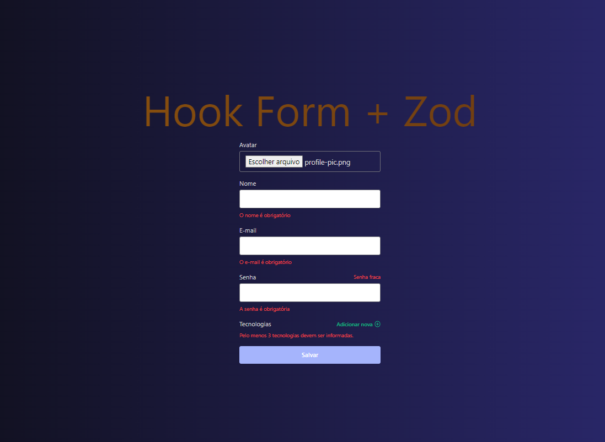

## Descrição do Projeto:

### A proposta do projeto foi criar um formulario avançado com as seguintes funcionalidades;

- [x] Validação / Transformação
- [x] Field Arrays
- [x] Upload de arquivos
- [x] Composition Pattern

## Código do Projeto
### App.tsx
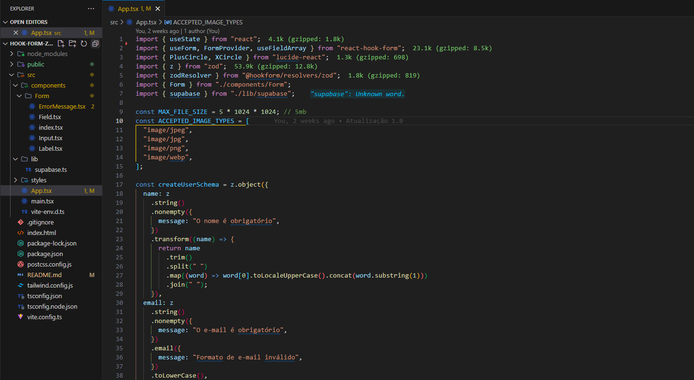
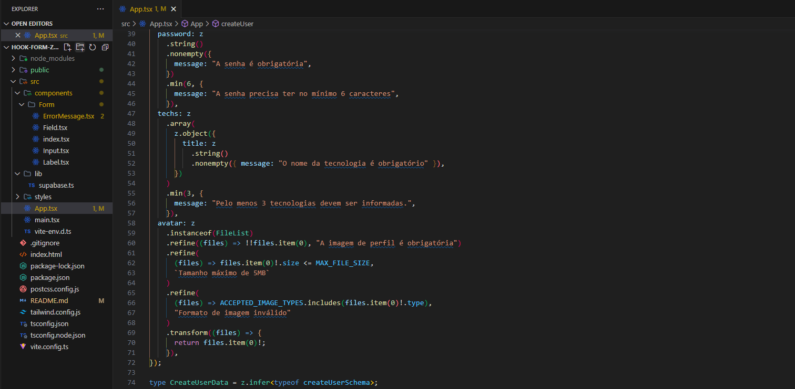
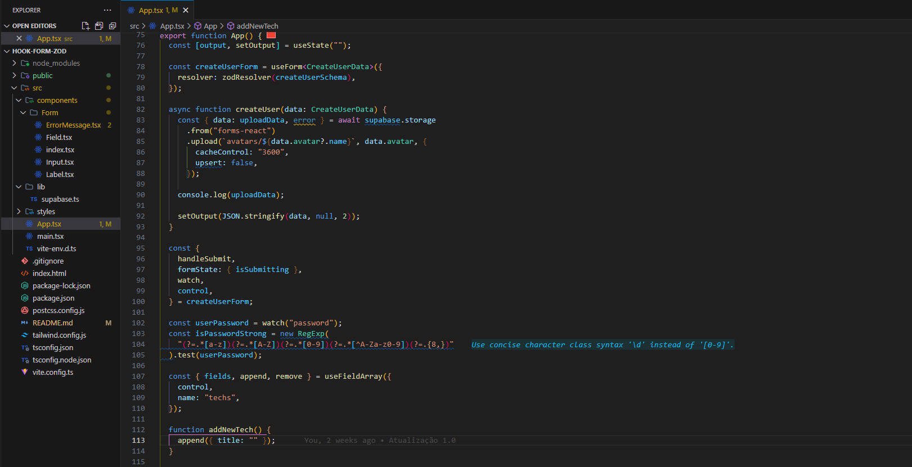
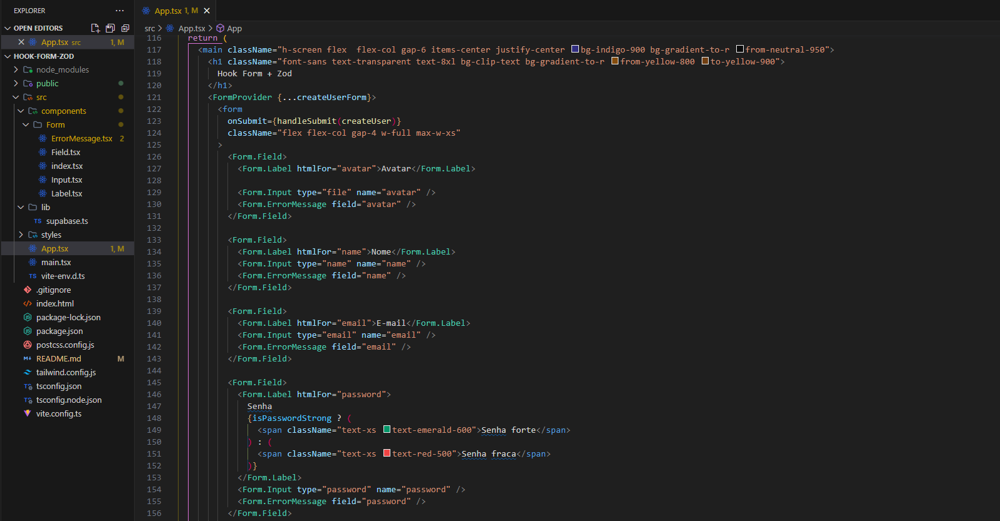
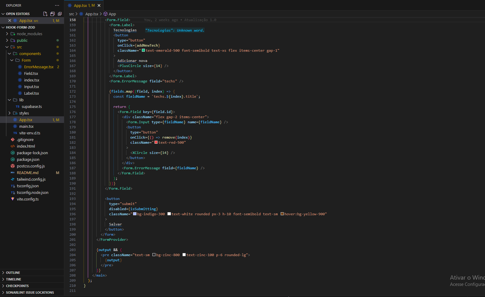

ErrorMessage.tsx
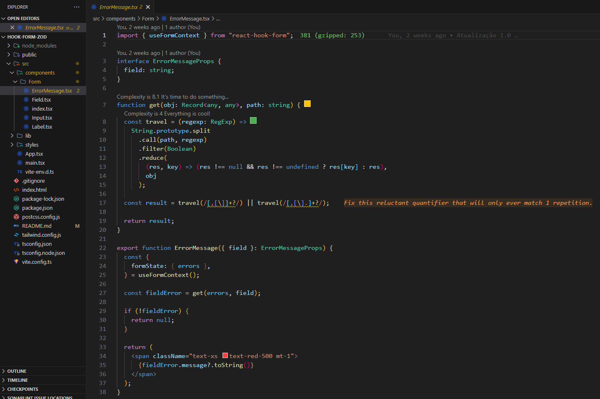

Field.tsx
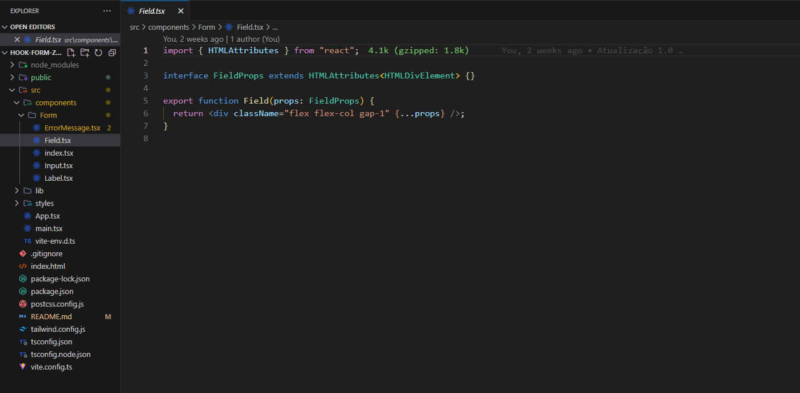

index.tsx
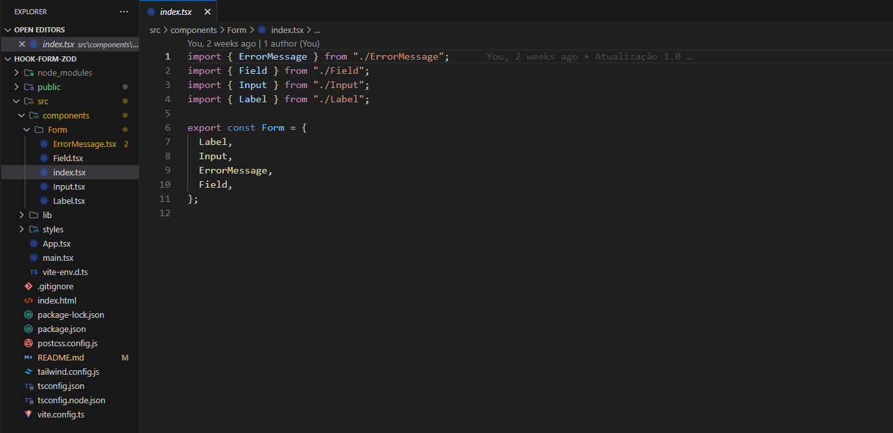

Input.tsx
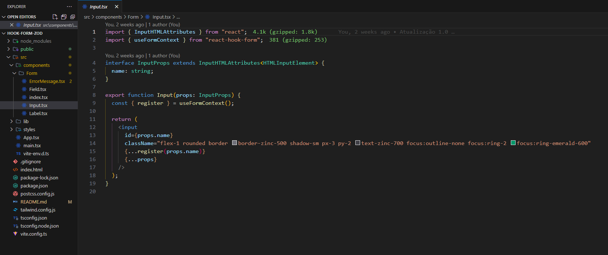

Label.tsx
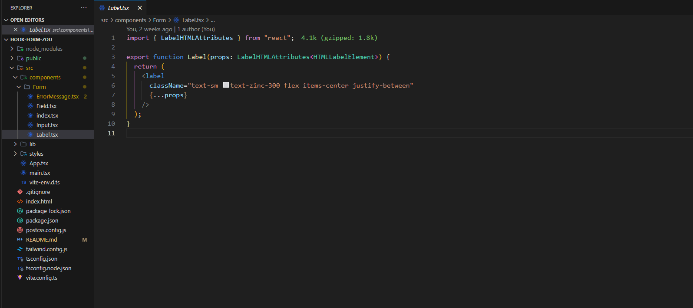

package.json
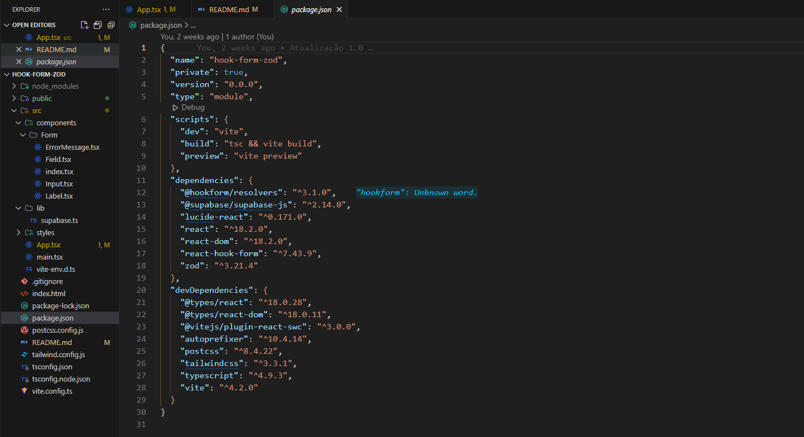

## Tecnologias que utilizei para o projeto ;

### Linguagem de Programação e Biblioteca;

 
 

   

 

### Linguagem de Estilização;

    

## Creditos:

### Este projeto foi desenvolvido em aula com o professor Diego Fernandes, Rocketseat.
