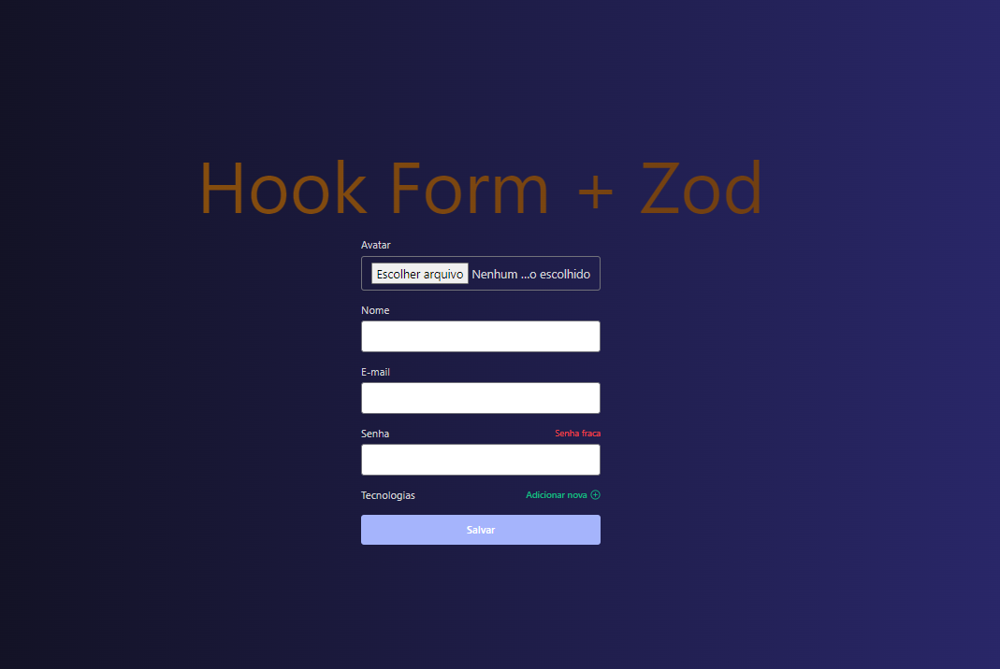

# Construindo um formulário avançado com hook form + zod.

## Descrição do Projeto:

### A proposta do projeto foi criar um formulario avançado com as seguintes funcionalidades;

- [x] Validação / Transformação
- [x] Field Arrays
- [x] Upload de arquivos
- [x] Composition Pattern

## Tecnologias que utilizei para o projeto ;

 
    
    

 

## Creditos:

### Este projeto foi desenvolvido em aula com o professor Diego Fernandes, Rocketseat.
